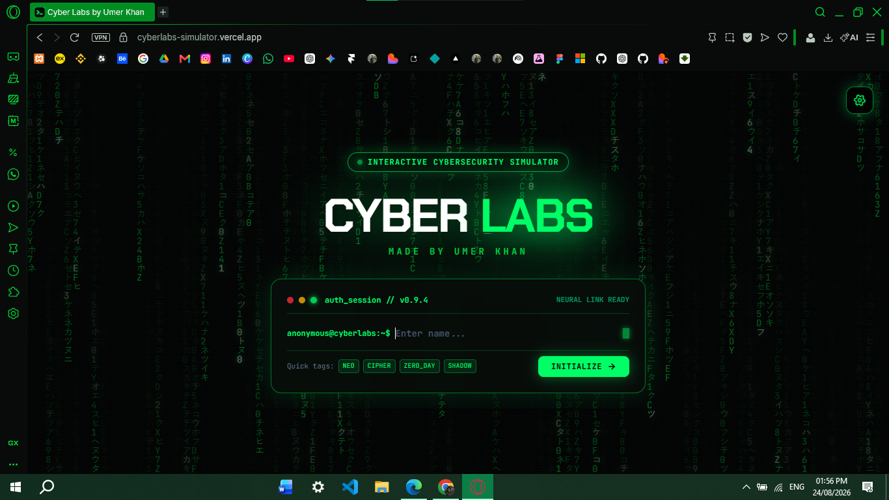

# CYBER LABS | Interactive Cybersecurity Training Simulator

### Overview

Cyber Labs is an **interactive cybersecurity training simulator** built around realistic terminal environments, offensive security scenarios, defensive operations, and hands-on investigation.

Instead of presenting cybersecurity concepts through traditional quizzes or passive learning cards, Cyber Labs puts the user inside simulated environments where they can **execute commands, investigate systems, analyze vulnerabilities, and respond to security incidents**.

The experience is divided into two operational paths:

- **Red Pill** — Offensive Cyber Operations
- **Blue Pill** — Defensive SOC & Incident Response

The entire experience runs in the browser, making it possible to explore cybersecurity workflows without requiring real targets, external infrastructure, or a backend.

---

### Project Status

- **Stability**: Production-ready
- **Deployment**: https://cyberlabs.vercel.app
- **Hosting**: Vercel
- **Architecture**: Frontend-only
- **Persistence**: Browser LocalStorage

---

### Core Capabilities

#### Interactive Terminal Environment

- Command-driven cybersecurity simulations
- Simulated Linux terminal workflows
- Command parsing and validation
- Dynamic terminal responses
- Realistic system feedback
- Mission-specific command environments

#### Dual Cybersecurity Tracks

**Red Pill — Offensive Operations**

- Linux permissions
- Network reconnaissance
- Web application security
- Privilege escalation
- Wireless security

**Blue Pill — Defensive Operations**

- Linux system hardening
- Firewall configuration
- Input and application defense
- SUID lockdown
- SOC investigation and packet analysis

#### Superuser Mode

A dedicated testing and evaluation environment allows access to the complete mission library without altering authentic user progression.

This makes it possible to demonstrate the entire simulator while keeping normal progression data isolated.

---

## Visual Representation

 

  

